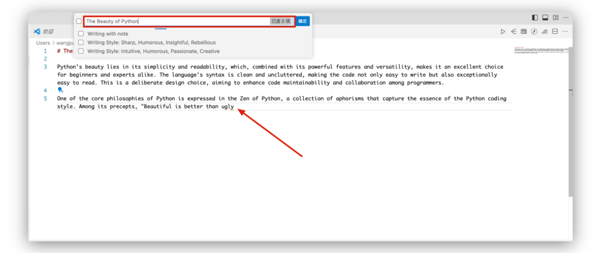
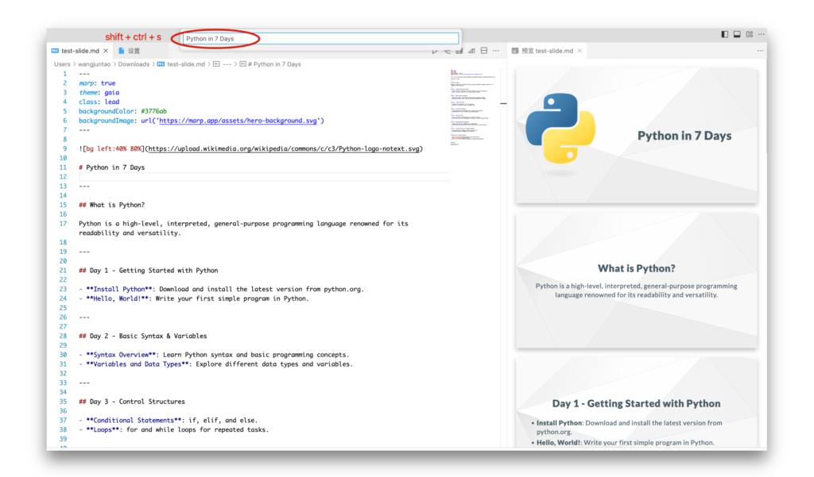
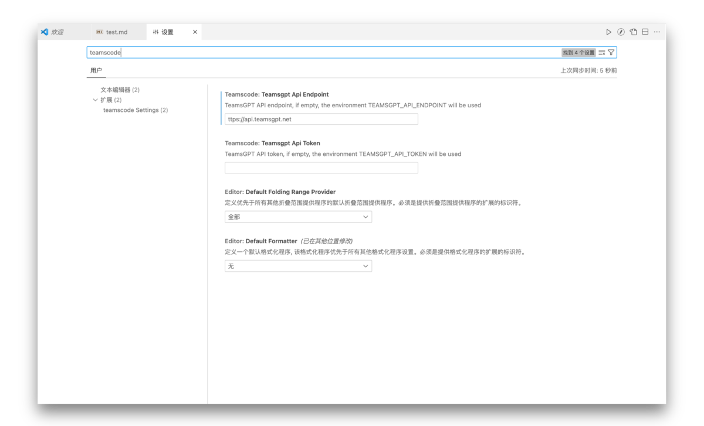

# TeamsCode

TeamsCode is an intelligent writing assistant designed for writers that integrates Openai Artificial Intelligence technology to enhance your writing experience in Visual Studio Code (VS Code).TeamsCode helps you get your work done faster. Its goal is to be your right hand in the writing process, whether you're writing a technical blog, an academic paper, or a novel.

## shortcut key

`alt+w`: Prompt input box pops up, enter prompts to generate content, automatically sends context to AI

`alt+s`: Select a piece of text, pop-up prompts for input, and summarize only the selected text.

`shift+ctrl+s`: Pop-up prompt entry box to enter prompts to generate Marp Slide

`shift+ctrl+c`: Open Extension Settings

`shift+ctrl+m`: Show Extension Commands

## Features

The TeamsCode extension includes the following features:

- **Contextual awareness**: Based on the content of the current document, TeamsCode can recognize and adapt to different writing styles and topics, and provide contextual vocabulary suggestions and sentence structure adjustments. It understands the specific needs of different text types, such as technical articles, storytelling, or academic arguments, and optimizes suggestions accordingly to ensure that your writing is coherent and accurate. 
- **Select Summary**: When you select a text in the Chinese file, TeamsCode can provide you with a short summary of the paragraph to help you quickly understand and review the main content. This feature is especially useful for reviewing previous chapters when editing a long article, and can help you quickly sort out key information when conducting academic research or literature reviews. 
- **Smart Continuation**: TeamsCode can generate continuation suggestions for you based on the previous content, and you can choose to accept complete sentences or inspiration points to quickly expand the content of the article. This feature is especially useful for finding new creative inspiration when you encounter creative bottlenecks. 
- **Generate Marp Slide**: TeamsCode simplifies the process of creating visually appealing Marp slides directly within VS Code. By leveraging the `shift+ctrl+s` shortcut, users can prompt an input box where they can enter specific prompts or topics. TeamsCode then intelligently generates a Marp slide presentation based on the provided input. This automation of slide creation saves time and enhances productivity, particularly for users who need to quickly prepare presentations for meetings, academic lectures, or tech talks. The generated slides are designed to be informative and aesthetically pleasing, ensuring that the presentation captures the audience's attention effectively.

### Preview Screenshot

The following are screenshots of the functions of the TeamsCode extension in different scenarios: 

- smart writing

- create marp slide

## Requirements

To use the TeamsCode extension, you'll need to install the latest version of VS Code and make sure your computer is connected to the internet so that AI tech can work. 

## Extension Settings

You can configure it through vscode's setup interface:

> After you have modified the interface, perform a `Reload Window` operation with `ctrl+shift+p`, or restart vscode.

## Known Issues

We are working hard to improve and will provide a better experience in the next version. 

## Working with Markdown

You can use Visual Studio Code to edit this README. Here are some useful editor keyboard shortcuts: 

- Split Editor ('Cmd+\' on macOS or 'Ctrl+\' on Windows and Linux)
- Toggle preview ('Shift+Cmd+V' on macOS or 'Shift+Ctrl+V' on Windows and Linux)
- Press 'Ctrl+Space' (Windows, Linux, macOS) to see a list of Markdown code snippets

## For more information

- [Visual Studio Code Markdown Support](http://code.visualstudio.com/docs/languages/markdown)
- [Markdown syntax reference](https://help.github.com/articles/markdown-basics/)

**Enjoy!**